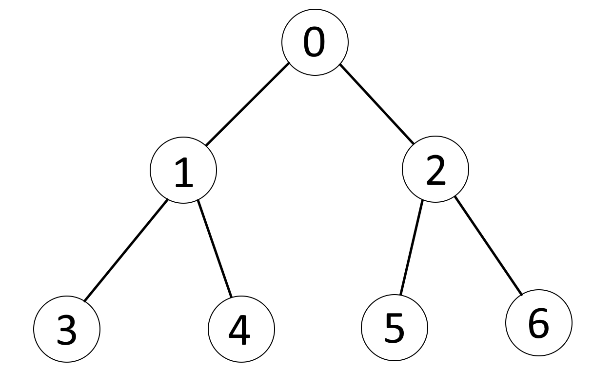

# Heap-optimization  
The structure of a heap can be represented as a tree in which each element has its own ordered index, its (two) "children" and its (one) "parent".  
  
If we know the index of a node, we can also find out the indexes of its parent and children.  
><a id="indexRule"> Index rule:</a>
>1) parent: **(n - 1) / 2**
>2) child left: **2n + 1**
>3) child right: **2n + 2**

## Add element to the heap
There are heap with **costs** of elements:

So we want add element with **cost 3**. First of all, we assign it the biggest index + 1. Then compare this element with his parent (find parent by [index rule](#indexRule)). If its cost smaller then parent cost, swap them and their indexes.  
  
Repeat this until the current element cost is greater than the parent cost. In the end we get the following:  
  
>Steps:  
>1) assign item the biggest index + 1
>2) compare with parent  
>3) if item.cost < parent.cost => swap item and parent
>4) repeat until item.cost >= parent.cost
***
# Thanks for [Sebastian Lague](https://www.youtube.com/@SebastianLague)