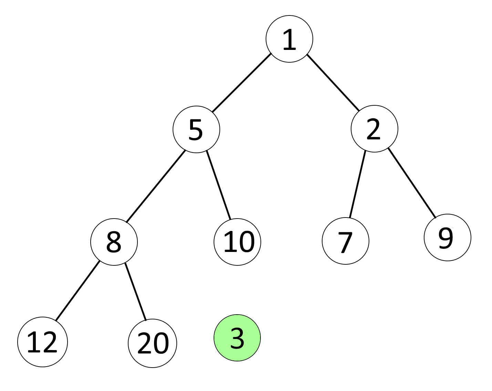
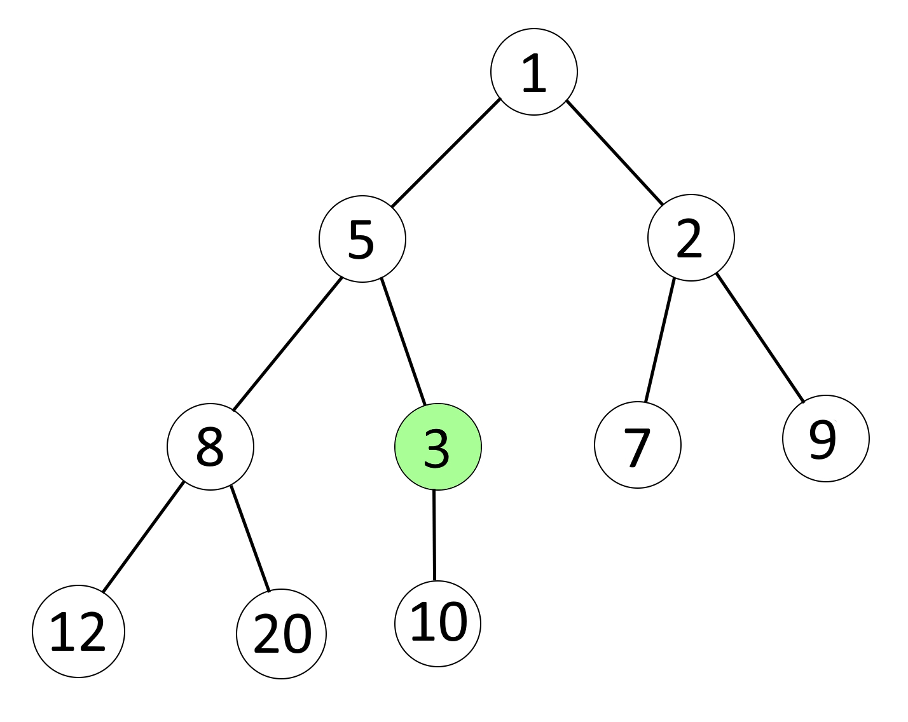
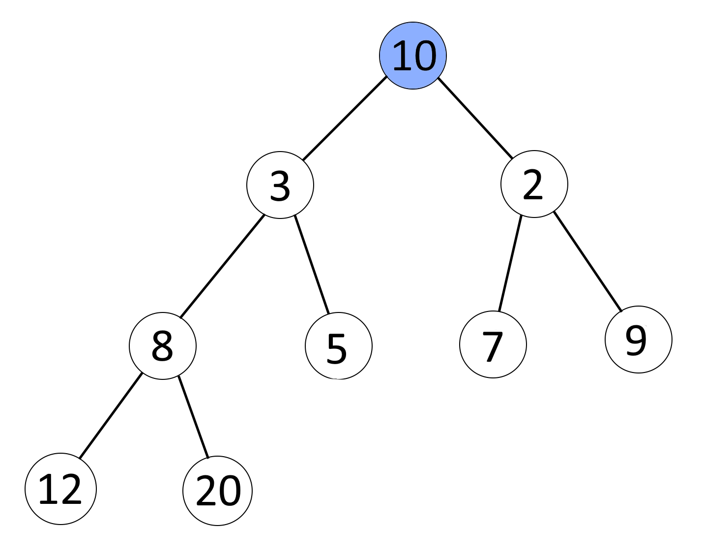

# Heap optimization  
The structure of a heap can be represented as a tree in which each element has its own ordered index, its (two) "children" and its (one) "parent".  
  
If we know the index of a node, we can also find out the indexes of its parent and children.  
><a id="indexRule"> Index rule:</a>
>1) parent: **(n - 1) / 2**
>2) child left: **2n + 1**
>3) child right: **2n + 2**

## Add element to the heap
There are heap with **costs** of elements:

So we want add element with **cost 3**. First of all, we assign it the biggest index + 1. Then compare this element with his parent (find parent by [index rule](#indexRule)). If its cost smaller then parent cost, swap them and their indexes.  
  
Repeat this until the current element cost is greater than the parent cost. In the end we get the following:  
  
>Steps:  
>1) assign item the biggest index + 1
>2) compare with parent  
>3) if item.cost < parent.cost => swap item and parent
>4) repeat until item.cost >= parent.cost
***
## Remove element from the heap
  
Now we want to **remove** element that has **lowest cost**. ***This element always has index 0***. Firstly, we should take element with the biggest cost to the top of the heap.  
  
After that, we do sorting down of this element on the top. Compare **cost** of current element with **costs** of children elements (we can find them by [index rule](#indexRule)). **Swap** current element with children, that has **lowest cost**.  
  
Repeat previous step until current element hasn't childrens. In the end we get the following:

>Steps:  
>1) remove first element
>2) take item with biggest index to the top (now it has index **0**) 
>3) if item has any children && any children has lower cost => swap item and children with lowest cost
>4) repeat until item hasn't any children || any children hasn't lower cost
***
# Thanks for [Sebastian Lague](https://www.youtube.com/@SebastianLague)
